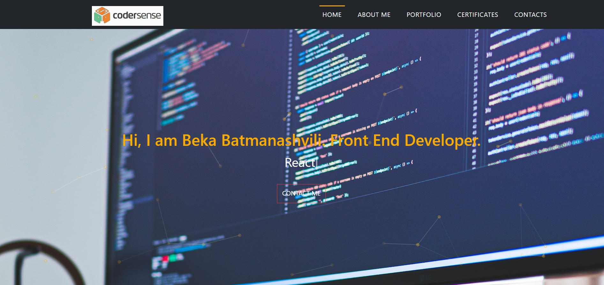

## Available Scripts

In the project directory, you can run:

### `npm start`

Runs the app in the development mode.\
Open [http://localhost:3000](http://localhost:3000) to view it in the browser.

The page will reload if you make edits.\
You will also see any lint errors in the console.

## Portfolio

<h1 align="center">Hi 👋, I'm Beka Batmanashvili</h1>
<h3 align="center">A passionate frontend developer from Georgia, Tbilisi.</h3>

  

  

- 🔭 I’m currently working on [Step ItAcademy Final Project](https://github.com/guramijibladze/it-step-project)

- 🌱 I’m currently learning **Angular (for basic understanding)**

- 👯 I’m looking to collaborate on **React Projects**

- 👨‍💻 All of my projects are available at [https://github.com/Beka-Bat1/portfolio-project](https://github.com/Beka-Bat1/portfolio-project)

- 💬 Ask me about **react**

- 📫 How to reach me **bekabatmanashvili1@gmail.com**

<h3 align="left">Connect with me:</h3>

<h3 align="left">Languages and Tools:</h3>

          

&nbsp;

